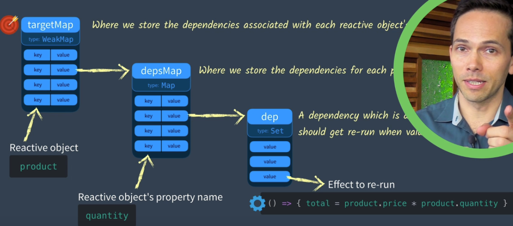

# 第一节课

图片很清楚了
```js
let product = {quantity: 2, price: 5}
let effect = () => {product.quantity * product.price}
let total = effect()

```
我们更新price或者quantity，total肯定不会变，但是Vue会自行修改total,所以我们可以将effect存储在一个名为dep的Set中(避免重复)，当发生改变时，我们去执行dep中的effect，就实现了响应式

左边是targetMap目标图，我们可能有多个响应式对象，对象每个属性需要响应式，targetMap存放响应式对象，本质上是Map。对象名字为key， 值为value，value即是depsMap,也是个Map，记录着对象的属性。每个value都是一个dep，用来存储effect

所以，写出如下函数
```js
const targetMap = new Map()

//存储effect到dep
const track = (target, key) => {
    if (!targetMap.get(target)) {
        targetMap.set(target, (new Map()))
    }

    const depsMap = targetMap.get(target)
    
    if (!depsMap.get(key)) {
        depsMap.set(key, new Set())
    }

    const dep = depsMap.get(key)
    dep.add(effect)
}

//执行，进行响应式
const trigger = (target, key) => {
    const depsMap = targetMap.get(target)
    
    if (!depsMap) return;

    const dep = depsMap.get(key)
    dep.forEach(effect => {
        effect()
    })
}


//测试
const product = {price: 5, quantity: 2}
let total = 0
const effect = () => {
    total = product.price * product.quantity
}

effect()
console.log(total)//10
track(product, 'price')
product.price = 6
console.log(total)//10
trigger(product, 'price')
console.log(total)//12
```
我们发现，只要trigger了之后，就可以响应式，第一节课完活

# 第二节课
```js
const targetMap = new Map()

const track = (target, key) => {
    if (!targetMap.get(target)) {
        targetMap.set(target, new Map())
    }

    const depsMap = targetMap.get(target)

    if (!depsMap.get(key)) {
        depsMap.set(key, new Set())
    }

    const dep = depsMap.get(key)
    dep.add(effect)
}

const trigger = (target, key) => {
    const depsMap = targetMap.get(target)

    if (!depsMap) return;

    const dep = depsMap.get(key)
    dep.forEach(effect => effect())
}

const reactive = (target) => {
    const handler = {
        get(target, key, receiver) {
            let res =  Reflect.get(target, key, receiver)
            track(target, key)
            return res
        },
        set(target, key, value, receiver) {
            let oldValue = target[key]
            let res =   Reflect.set(target, key, value, receiver)
            if (oldValue !== value) {
                trigger(target, key)
            }
            return res
        }
    }
    return new Proxy(target, handler)
}

const product = reactive({ price: 5, quantity: 2 })
let total = 0
const effect = () => {
    total = product.price * product.quantity
}

effect()
console.log(total)

product.price = 6
console.log(total)
```
其实就是将Proxy进行应用，同时将track、trigger融入Proxy，很巧妙的在更新值和获取值的时候进行了响应式处理， 酷

# 第三课
我们不能每次get一个属性，就track，那会很浪费一些性能。所以，我们引入activeEffect，更改effect，将effect设为一个函数，他接受一个函数作为参数。所以要做的更新以函数的形式传入effect， 其他在代码上注释
```js
const targetMap = new Map()

const track = (target, key) => {
    if (activeEffect) {
        //只有在activeEffect不为null运行，进行track，所以只是get对象的值不会导致track
        if (!targetMap.get(target)) {
            targetMap.set(target, new Map())
        }
    
        const depsMap = targetMap.get(target)
    
        if (!depsMap.get(key)) {
            depsMap.set(key, new Set())
        }
    
        const dep = depsMap.get(key)
        dep.add(activeEffect)
    }
}

const trigger = (target, key) => {
    const depsMap = targetMap.get(target)

    if (!depsMap) return;

    const dep = depsMap.get(key)
    dep.forEach(effect => effect())
}

const reactive = (target) => {
    const handler = {
        get(target, key, receiver) {
            let res =  Reflect.get(target, key, receiver)
            track(target, key)
            return res
        },
        set(target, key, value, receiver) {
            let oldValue = target[key]
            let res =   Reflect.set(target, key, value, receiver)
            if (oldValue !== value) {
                trigger(target, key)
            }
            return res
        }
    }
    return new Proxy(target, handler)
}

let activeEffect = null
function effect(eff)  {
    activeEffect = eff
    activeEffect()//执行函数，因为会get一些属性，所以在此时track
    activeEffect = null
}

const product = reactive({ price: 5, quantity: 2 })
let total = 0
let salePrice = 0
effect(() => {
    total = product.price * product.quantity
})
effect(() => {
    salePrice = product.price * 0.9
})

console.log(total, salePrice)
product.quantity = 3
console.log(total, salePrice)
product.price = 10
console.log(total, salePrice)
```

如果加入这么个测试用例就不行了
```js
const product = reactive({ price: 5, quantity: 2 })
let total = 0
let salePrice = 0
effect(() => {
    total = salePrice * product.quantity //salePrice是和之前的不同之处
})
effect(() => {
    salePrice = product.price * 0.9
})

console.log(total, salePrice)
product.quantity = 3
console.log(total, salePrice)
product.price = 10
console.log(total, salePrice)
```
因为total会随着salePrice变化而变化，但是total没有track过salePrice,所以product.price = 10影响了salePrice，但是无法影响total，因为salePrice不是响应式，所以需要

ref
```js
const product = reactive({ price: 5, quantity: 2 })
let total = 0
let salePrice = ref(0)
effect(() => {
    total = salePrice.value * product.quantity //salePrice是和之前的不同之处
})
effect(() => {
    salePrice.value = product.price * 0.9
})

console.log(total, salePrice)
product.quantity = 3
console.log(total, salePrice)
product.price = 10
console.log(total, salePrice)
```


所以定义ref如下
```js
const targetMap = new Map()

const track = (target, key) => {
    if (activeEffect) {
        if (!targetMap.get(target)) {
            targetMap.set(target, new Map())
        }
    
        const depsMap = targetMap.get(target)
    
        if (!depsMap.get(key)) {
            depsMap.set(key, new Set())
        }
    
        const dep = depsMap.get(key)
        dep.add(activeEffect)
        
    }
}

const trigger = (target, key) => {
    const depsMap = targetMap.get(target)

    if (!depsMap) return;

    const dep = depsMap.get(key)
    dep.forEach(effect => effect())
}

const reactive = (target) => {
    const handler = {
        get(target, key, receiver) {
            let res =  Reflect.get(target, key, receiver)
            track(target, key)
            return res
        },
        set(target, key, value, receiver) {
            let oldValue = target[key]
            let res =   Reflect.set(target, key, value, receiver)
            if (oldValue !== value) {
                trigger(target, key)
            }
            return res
        }
    }
    return new Proxy(target, handler)
}

function ref(raw) {
    const r = {
        get value() {
            track(r, 'value')
            return raw
        },
        set value(newVal) {
            if (raw === newVal) return;
            raw = newVal
            trigger(r, 'value')

        }
    }
    return r
}

let activeEffect = null
function effect(eff)  {
    activeEffect = eff
    activeEffect()
    activeEffect = null
}

const product = reactive({ price: 5, quantity: 2 })
let total = 0
let salePrice = ref(0)
effect(() => {
    total = salePrice.value * product.quantity //salePrice是和之前的不同之处
})
effect(() => {
    salePrice.value = product.price * 0.9
})

console.log(total, salePrice.value)
product.quantity = 3
console.log(total, salePrice.value)
product.price = 10
console.log(total, salePrice.value)

```

应用了js对对象的计算器属性，如果get就track， set就trigger
计算total的时候，salePrice进行了get，所以会track计算total的函数
当我们计算salePrice时，会trigger那个函数，从而更新total
