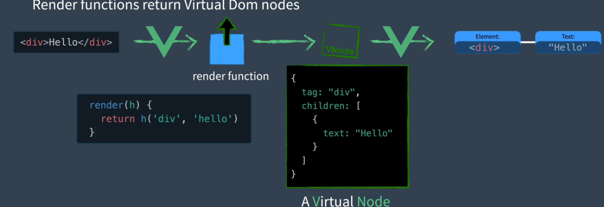

# 学习源码
学习Vue Mastery的一门课程，学习Vue3源码
## 整体介绍

1. 这就是Vue的大致运行过程，首先将模板转变为render function渲染函数，然后由渲染函数生成一个虚拟DOM，最后将虚拟Dom转变为真正的DOM节点，进行挂载


为什么要用Virtual DOM， 因为直接频繁操作DOM会很耗费性能，如果用虚拟DOM， 当我们修改组件时， 会将新旧虚拟DOM进行对比，最后选取合适的方式进行调整


2. Vue有三个模块，Reactivity Module响应式模块， Compiler Module编译器模块， Renderer Module 渲染模块

Reactivity Module： 创建响应式对象，并且进行跟踪，如果相关代码被运行，就是发生响应

Compiler Module:将template转为render function

Renderer Module: 
包含三个阶段，
Render Phase渲染阶段: 将render function转为虚拟DOM
Mount Phase挂载阶段:用虚拟DOM创建网页
Patch Phase补丁阶段： 比较新旧虚拟DOM，进行更新页面变化部分

## compiler
vue的编译器，会将我们的模板生成为render  function
如果是这样的
```html
<div>hello</div>
```
他是静态的，所以我们可以进行提升已记录，这样可以在每次渲染中，避免重复创建对象，它的好处是：1. 避免销毁对象再重复创建，利于垃圾清理 2. 在算法对比时，因为是静态的，所以一定不会变，所以不会去比较

```html
<div>{{msg}}</div>
```
像这种是动态

```html
<div>
    <div>{{msg}}</div>
</div>
```
这么一个结构可以成为一个块，块虽然是个树，但是我们块会有一个额外数组记录内部动态节点， 数组是扁平的，所以对于动态节点的操作可以通过这个数组，而无须去递归遍历一棵树


## 模拟简化render函数
```html
<div id="app"></div>

<style>
    .red {
        color: red;
    }
</style>

<script>
function h(tag, props, children) {
    return {
        tag,
        props,
        children
    }
}

function mount(vnode, container) {
    const el = vnode.el = document.createElement(vnode.tag)
    if (vnode.props) {
        for (const key in vnode.props) {
        const value = vnode.props[key]
        el.setAttribute(key, value)
        }
    }
    if (vnode.children) {
        if (typeof vnode.children === 'string') {
            el.textContent = vnode.children
        } else {
            vnode.children.forEach(child => {
                mount(child, el)
            })
        }
    }
    
    
    container.append(el)
}

const vdom = h('div', { class: 'red' }, [
    h('span', null, 'hello')
])

mount(vdom, document.getElementById('app'))
</script>
```

实现了patch
```js
function patch(n1, n2) {
    if (n1.tag === n2.tag) {
        const el = n2.el = n1.el
        const oldProps = n1.props || {}
        const newProps = n2.props || {}
        for (const key in newProps) {
            const oldValue = oldProps[key]
            const newValue = newProps[key]
            if (newValue !== oldValue) {
                el.setAttribute(key, newValue)
            }
        }
        for (const key in oldProps) {
            if (!key in newProps) {
                el.removeAttribute(key)
            }
        }

        //children
        const oldChildren = n1.children
        const newChildren = n2.children
        if (typeof newChildren === 'string') {
            if (typeof oldChildren === 'string') {
                if (newChildren !== oldChildren) {
                    el.textContent = newChildren
                }
            } else {
                el.textContent = newChildren
            }
        } else {
            if (typeof oldChildren === 'string') {
                el.innerHTML = ''
                newChildren.forEach(child => {
                    mount(child, el)
                })
            } else {
                const commonLength = Math.min(newChildren.length, oldChildren.length)
                for (let i = 0; i < commonLength; i++) {
                    patch(oldChildren[i], newChildren[i])
                }
                if (newChildren.length > oldChildren.length) {
                    newChildren.slice(commonLength).forEach(child => mount(child, el))
                } else if (oldChildren.length > newChildren.length) {
                    oldChildren.slice(commonLength).forEach(child => el.removeElement(child.el))
                }
            }
        }
    } else {

    }
}
```

基本的响应式
```js
let activeEffect
class Dep {
    constructor(value) {
        this._value = value
        this.subscribers = new Set()
    }
    get value() {
        this.depend()
        return this._value
    }
    set value(newVal) {
        this._value = newVal
        this.notify()
    }
    depend() {
        if (activeEffect) {
            this.subscribers.add(activeEffect)
        }
    }
    notify() {
        this.subscribers.forEach(effect => {
            effect()
        })
    }
}

function watchEffect(effect) {
    activeEffect = effect
    activeEffect()
    activeEffect = null
}

const msg = new Dep('hello')
const ok = new Dep(true)

watchEffect(() => {
    if (ok.value) {
        console.log(msg.value)
    } else {
        console.log('error')
    }
})
```